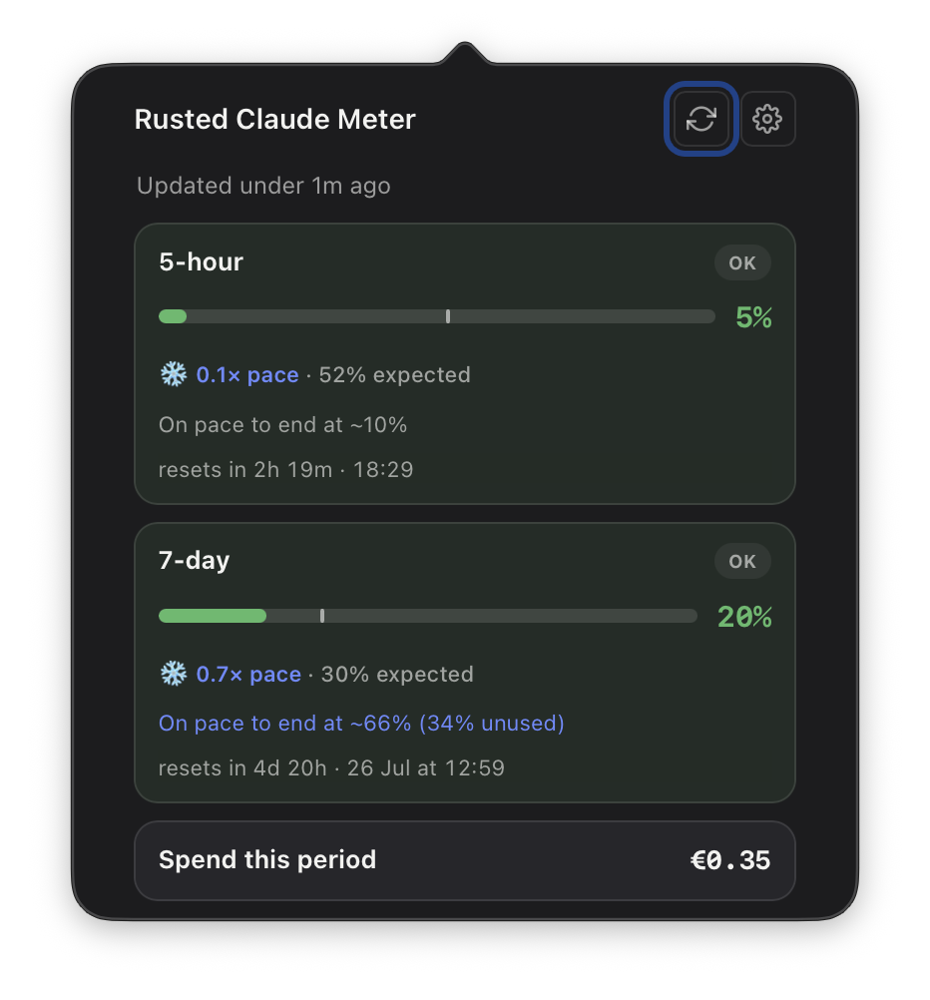
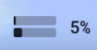
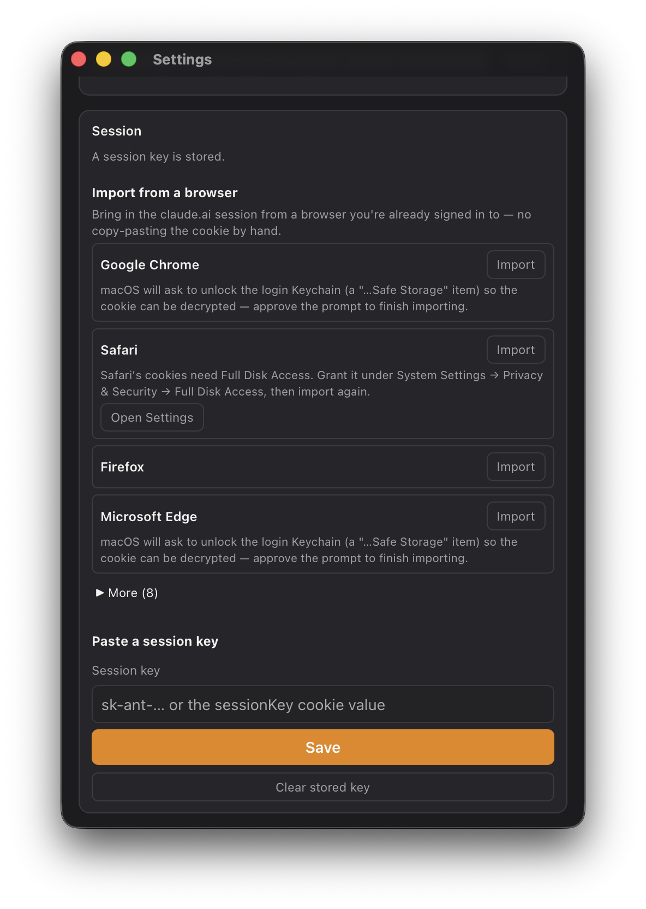
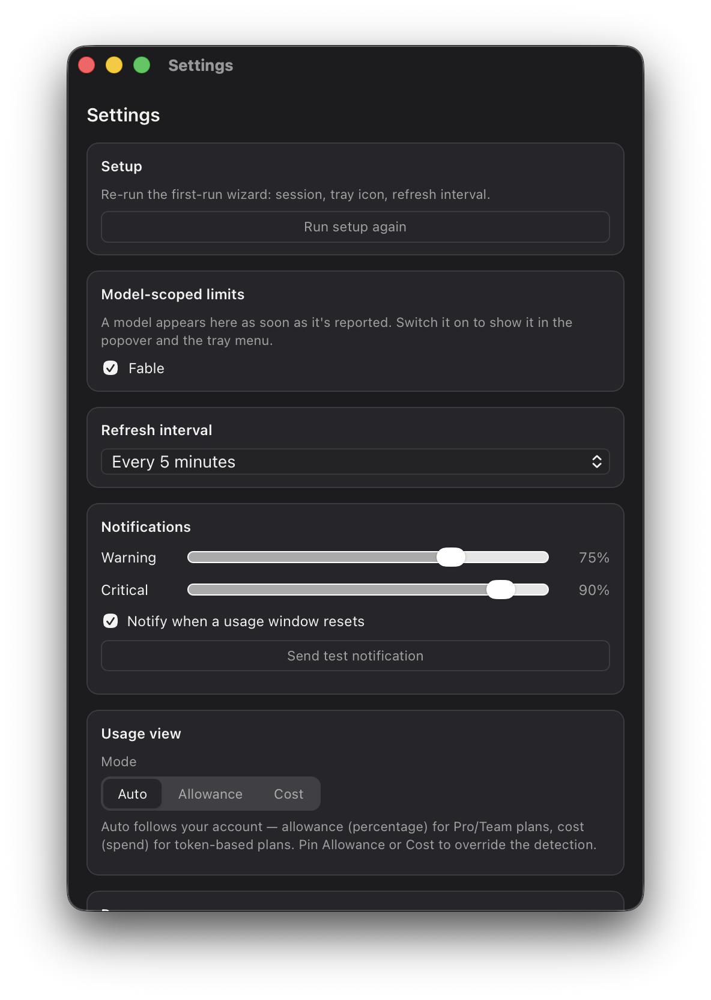
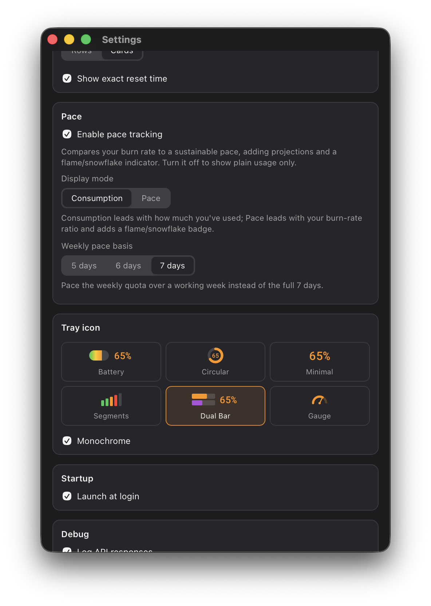

# Rusted Claude Meter

A cross-platform (macOS + Linux) tray app that shows your Claude plan usage at a glance — a Tauri v2 port of [ClaudeMeter](https://github.com/eddmann/ClaudeMeter).

It polls your `claude.ai` usage with your browser session and renders a colour-coded gauge in the menu bar / system tray, plus a popover with per-window cards (5-hour session, 7-day week), **burn-rate pacing**, and **model-scoped limits** — each limit names its own model, so a newly released model shows up with no update.

<p align="center">
  
</p>

## Features

- **Menu-bar / tray gauge**  — your current usage, colour-coded green → amber → red against thresholds you set. Six icon styles (Battery, Circular, Minimal, Segments, Dual Bar, Gauge), with an optional monochrome mode.
- **Usage popover** (macOS) / **tray menu** (Linux) — a live card per window: 5-hour session, 7-day week, and one per model-scoped limit, each with percent, reset time, and estimated spend.
- **Burn-rate pacing** — compares how fast you're spending to a sustainable pace, projects where you'll land, and flags overuse (🔥) / underuse (❄️). Pace the weekly quota over a 5-, 6-, or 7-day working week.
- **Model-scoped limits** — reads the API's `limits` array, so per-model caps (e.g. Fable, Sonnet) appear automatically; toggle each on/off.
- **Threshold notifications** — warning/critical alerts and an optional "your window just reset" ping.
- **Allowance or cost view** — auto-detects percentage (Pro/Team) vs. spend (token-based) plans, or pin either.
- **Easy sign-in** — import the `claude.ai` session straight from a browser you're already logged into (Chrome, Safari, Firefox, Edge, and more), or paste a session key by hand.
- **Statusline export** — writes `~/.claudemeter/usage.json` after every fetch for statusline scripts and other tools (schema-compatible with the original ClaudeMeter — see [External integrations](#external-integrations)).
- **Launch at login**, configurable refresh interval, and a first-run setup wizard.

## Install

### macOS (Apple Silicon)

**Homebrew (recommended)** — tap once, then install:

```sh
brew tap mpecan/tools   # one-time — github.com/mpecan/homebrew-tools

brew install --cask rusted-claude-meter        # full
brew install --cask rusted-claude-meter-lite   # lite — no browser import, EDR-safe (see below)
```

Once tapped you can refer to the casks by their short names above; `brew upgrade` keeps them current. (Prefer not to tap? The fully-qualified `brew install --cask mpecan/tools/rusted-claude-meter[-lite]` works without tapping first.)

**Direct download:** grab a `.dmg` from the [latest release](https://github.com/mpecan/rusted-claude-meter/releases/latest), open it, and drag the app to Applications. The build is Developer ID-signed and Apple-notarized, so it opens without a Gatekeeper override.

#### Which macOS build? Full vs. Lite

macOS ships in two DMG shapes — pick by how you want to sign in:

| | **Full** — `Rusted Claude Meter_<version>_aarch64.dmg` | **Lite** — `Rusted Claude Meter Lite_<version>_aarch64.dmg` |
|---|---|---|
| Cask | `mpecan/tools/rusted-claude-meter` | `mpecan/tools/rusted-claude-meter-lite` |
| **Automatic browser import** | ✅ import the session straight from Chrome/Safari/Firefox/Edge/… | ❌ compiled out entirely |
| Paste a session key by hand | ✅ | ✅ |
| Reads another app's cookie store | Yes (only when you click Import) | **Never** — the cookie-reading code isn't in the binary |
| Best for | Most people — one-click sign-in | Locked-down / EDR-managed machines where reading a browser cookie store trips security tooling (see [below](#antivirus--edr-false-positives)) |

Both are identical otherwise. If you're unsure, start with **Full**; switch to **Lite** only if your endpoint protection objects.

> **macOS support is Apple Silicon (M-series) only** for now — no Intel x86_64 build is published yet.
>
> If your endpoint protection flags the download, it's a false positive — see [Antivirus / EDR false positives](#antivirus--edr-false-positives). The **`-lite`** build avoids the trigger entirely.

### Linux (x86_64)

Download from the [latest release](https://github.com/mpecan/rusted-claude-meter/releases/latest):

- **AppImage** — `Rusted Claude Meter_<version>_amd64.AppImage`; `chmod +x` and run it.
- **Debian/Ubuntu** — `Rusted Claude Meter_<version>_amd64.deb`; `sudo apt install ./<file>.deb`.

> Linux builds are **amd64 only**. On **GNOME** you also need the [AppIndicator extension](https://extensions.gnome.org/extension/615/appindicator-support/) for the tray icon to appear; **KDE Plasma** shows it out of the box. Because StatusNotifierItem gives no click events on Linux, the **tray menu is the primary surface** (there's no popover).

## Usage

On first launch a **setup wizard** walks you through connecting your account, picking a tray-icon style, and setting the refresh interval. You can re-run it any time from **Settings → Setup → Run setup again**.

### 1. Connect your Claude account

The app reads your usage using your existing `claude.ai` browser session — there's no separate login. Two ways to provide it, both in **Settings → Session**:

<p align="center">
  
</p>

- **Import from a browser** *(full build only)* — pick the browser you're signed into (Chrome, Safari, Firefox, Edge, …) and click **Import**. macOS may ask to unlock the login Keychain so the cookie can be decrypted; Safari additionally needs Full Disk Access.
- **Paste a session key** — paste either an `sk-ant-…` key or the raw `sessionKey` cookie value. To find the cookie: on `claude.ai`, open your browser's dev tools → **Application → Cookies → `sessionKey`**, and copy the value. (This is the only sign-in path in the `-lite` build.)

Your key is stored in the OS keychain and only ever sent to `claude.ai`. `SessionKey` redacts itself in logs.

### 2. Read the meter

The tray icon shows your headline usage; open the popover (macOS: left-click the icon) or tray menu (Linux: click the icon) for the full breakdown — per-window cards with pace, a projection of where you'll land, reset time, and spend this period.

### 3. Make it yours

Everything is in **Settings**:

<p align="center">
  
  
</p>

- **Tray icon** — six styles, plus a monochrome toggle for menu-bar themes that prefer it.
- **Pace** — turn burn-rate tracking on/off, lead with consumption or pace, and set the weekly pace basis (5/6/7 days).
- **Notifications** — warning and critical thresholds (which also drive the icon colours) and a reset ping; send a test notification to check it works.
- **Model-scoped limits** — flip each reported model on to show it in the popover and tray.
- **Refresh interval**, **usage view** (Auto / Allowance / Cost), and **Launch at login**.

## Status

Feature-complete port, actively developed. The tray icon (six styles), the native macOS `NSPopover` (two switchable layouts), the Linux tray menu, a dedicated Settings window with a first-run wizard, threshold notifications, `usage.json` export, browser session import, launch-at-login, and packaging/release CI are all implemented. Bugs and follow-ups are tracked in [the issues](https://github.com/mpecan/rusted-claude-meter/issues).

## Architecture

| Crate | Responsibility |
|---|---|
| `crates/meter-core` | Platform-neutral domain: usage windows, scoped limits, status thresholds, pacing risk, session-key parsing. No I/O. |
| `crates/meter-api` | claude.ai API client: browser-header spoofing, response decoding, mapping into domain types. |
| `crates/meter-render` | Pure tray-icon rendering: `IconState` → parameterized SVG → RGBA pixels. No platform code. |
| `src-tauri` | Application shell: tray, windows, scheduler, notifications, secure storage, settings. |
| `src/` | Webview frontend (popover cards, settings, wizard) — vanilla TypeScript + Vite. |

Interaction model is platform-idiomatic:

- **macOS** — left-click the menu-bar icon to toggle a native `NSPopover` (via [`tauri-plugin-nspopover`](https://github.com/freethinkel/tauri-nspopover-plugin)) that hosts the webview: it drops down anchored under the status item with the arrow, slide animation and click-outside dismissal you expect. Settings open in their own dedicated window (front-most despite the accessory activation policy). Right-click serves the tray menu. The popover offers two layouts — compact **rows** or roomier **status cards** — switchable in Settings; both colour green → amber → red and raise an escalating fire glyph keyed to your configured warning/critical thresholds.
- **Linux** — StatusNotifierItem/AppIndicator delivers **no click events and no tooltip**, so the tray menu is the primary surface: a status line plus one live line per usage window (5-hour, 7-day, and each model-scoped limit) with percent and reset time, then Open / Refresh Now / Quit. Menu text updates in place — the tray icon is never recreated, so updates don't flicker. On GNOME the [AppIndicator extension](https://extensions.gnome.org/extension/615/appindicator-support/) is required for the tray icon to appear at all; KDE Plasma shows it out of the box.

## External integrations

After every successful fetch, the app writes `~/.claudemeter/usage.json` — a public, typed export of current usage for statusline scripts and other external tools. The write is atomic (temp file + rename), so a script never observes a truncated file, and a failed write is logged but never fails the refresh itself.

The path is shared with the Swift [ClaudeMeter](https://github.com/eddmann/ClaudeMeter) app **intentionally**, so existing statusline integrations keep working unmodified when switching between the two. If both apps run at once, whichever fetches most recently wins — there is no locking or merging between them.

Schema (mirrors `ClaudeMeter`'s `UsageExportPayload`, [eddmann/ClaudeMeter#32](https://github.com/eddmann/ClaudeMeter/pull/32)):

```json
{
  "session_usage": { "utilization": 42.5, "reset_at": "2026-07-17T15:00:00Z" },
  "weekly_usage": { "utilization": 60.0, "reset_at": "2026-07-20T00:00:00Z" },
  "scoped_usage": [
    { "name": "Fable", "limit": { "utilization": 12.0, "reset_at": "2026-07-20T00:00:00Z" }, "is_active": true }
  ],
  "sonnet_usage": null,
  "last_updated": "2026-07-17T12:00:00Z"
}
```

`scoped_usage` is the general, forward-compatible form — one entry per model-scoped limit the API reports. `sonnet_usage` is a deprecated alias kept for backward compatibility: it mirrors the scoped entry named "Sonnet" (case-insensitive) when one exists, or `null` otherwise, so scripts written against the older Sonnet-only export keep working.

**Deviation from the Swift app:** in `ClaudeMeter`'s `UsageExportPayload`, `session_usage`/`weekly_usage` are non-optional — a snapshot missing a headline window either fails the fetch outright or gets a synthesized fallback reset time. This app's domain model already collapses "missing" into `None` with no data left to synthesize a fallback from, so on the rare snapshot without a headline window this export writes `session_usage`/`weekly_usage` as JSON `null` rather than omitting the field. Consumers written against the Swift app's non-optional guarantee should null-check these two fields.

### Antivirus / EDR false positives

Some endpoint-protection products — notably Palo Alto **Cortex XDR** (its
"Local Analysis" module) — may flag the macOS build as malware. **This is a
false positive.** The download is a Developer ID-signed, Apple-notarized build
(Apple Team ID `A98UV6DX7K`) of this open-source code, and the app only ever
talks to `claude.ai`.

Local Analysis is an on-device static-ML classifier that errs toward flagging
*unknown, low-prevalence* binaries before they ever run — a freshly-signed
release with little install history is a textbook trigger, and a later cloud
(WildFire) verdict overrides it. (Behavioural EDRs may separately flag the
opt-in "import session from a browser" step, which reads your browser's
`claude.ai` cookie — the same access pattern a credential stealer uses; see
[External integrations](#external-integrations).)

To resolve it:

- **Use the `-lite` build.** A build variant compiles out browser import (and
  the `rookie` cookie crate) entirely, so the binary never reads another app's
  cookie/credential store — the behaviour that trips these heuristics. Manual
  session-key paste still works. See
  [`docs/packaging.md`](docs/packaging.md) → "Build variants".
- **Allow-list by code signer / Apple Team ID `A98UV6DX7K`** in your EDR —
  durable across every future signed release, unlike a per-build hash.
- **Report the false positive** to your vendor so their cloud verdict
  reclassifies the build as benign, which then overrides the local verdict for
  everyone.

Distributing through the Mac App Store would *not* fix this and isn't viable
anyway: the App Store mandates the App Sandbox, which forbids reading another
browser's cookie store — exactly the mechanism the session import depends on.

## Development

Prerequisites: Rust (pinned via `rust-toolchain.toml`), Node ≥ 24 (pinned via `package.json` `engines`), [`just`](https://github.com/casey/just).

On Linux additionally: `libwebkit2gtk-4.1-dev libayatana-appindicator3-dev librsvg2-dev libxdo-dev libssl-dev libgtk-3-dev`. GNOME needs the [AppIndicator extension](https://extensions.gnome.org/extension/615/appindicator-support/) to show tray icons at all.

```sh
just setup   # npm install, frontend build, git hooks
just dev     # run the app with hot reload
just check   # everything CI runs: fmt, clippy -D warnings, tests, file sizes,
             # cargo-deny, cargo-dupes, coverage floor, frontend typecheck + tests
```

`just check` needs a few cargo tools beyond `just setup` — see [CONTRIBUTING.md](CONTRIBUTING.md#setup). Contributions are welcome; see [CONTRIBUTING.md](CONTRIBUTING.md) for the ground rules and quality gates.

## Packaging & releases

Releases are driven by release-please: merging its release PR cuts a GitHub
Release and `v*` tag, which builds a signed + notarized macOS DMG (signed on
macOS, then notarized + stapled on Linux via `rcodesign`), a Linux AppImage
and `.deb`, and Homebrew casks (full + lite), uploads them to that Release, and
pushes the casks to the `mpecan/homebrew-tools` tap — see
[`docs/packaging.md`](docs/packaging.md) for the release process, the Apple
signing/notarization secrets it needs, and the Flatpak evaluation findings.

## Quality bar

- `cargo clippy --workspace --all-targets -- -D warnings` with `pedantic` + `nursery` enabled and `unwrap_used` / `expect_used` / `panic` / `todo` **denied** (tests may opt out locally).
- `unsafe_code` is forbidden workspace-wide.
- Source files stay under 500 lines (soft) / 700 (hard) — `scripts/check-file-sizes.sh`.
- Every behaviour lands with tests; API contracts are pinned by fixtures in `crates/meter-api/tests/fixtures/`.
- `cargo-deny` (`deny.toml`) gates dependency licenses, security advisories, banned crates, and dependency sources.
- `cargo-dupes` gates structural code duplication against a ratcheted ceiling.
- `cargo-llvm-cov` gates test coverage against a ratcheted floor — see the `coverage` job in `.github/workflows/ci.yml` for the PR-facing report.
- Dependabot keeps cargo, npm, and GitHub Actions dependencies current (`.github/dependabot.yml`).

## Acknowledgements

Rusted Claude Meter is a port of — and was directly inspired by — **[ClaudeMeter](https://github.com/eddmann/ClaudeMeter)** by [Edd Mann](https://github.com/eddmann), the original SwiftUI menu-bar app for macOS. This project reimplements that idea in Rust + Tauri to bring it to Linux as well, and deliberately keeps its `~/.claudemeter/usage.json` [export schema-compatible](#external-integrations) so statusline integrations built for ClaudeMeter keep working. Huge thanks to Edd for the original app and the design it established. If you're on macOS and want the original Swift experience, go check it out.

## License

[MIT](LICENSE) © 2026 Matjaz Domen Pecan. All crates in the workspace inherit `license = "MIT"` from the root `Cargo.toml`.

Third-party notices:

- The tray-icon renderer bundles a subsetted **Roboto Mono** (digits and `%` only) to bake the percentage into the icons, under the SIL Open Font License 1.1 — see [`crates/meter-render/assets/RobotoMono-LICENSE.txt`](crates/meter-render/assets/RobotoMono-LICENSE.txt).
- The macOS `NSPopover` integration uses [`tauri-plugin-nspopover`](https://github.com/freethinkel/tauri-nspopover-plugin) (MIT), pinned by commit.
- Dependency licenses are gated by `cargo-deny` (`deny.toml`); the allowed set is enumerated there.
