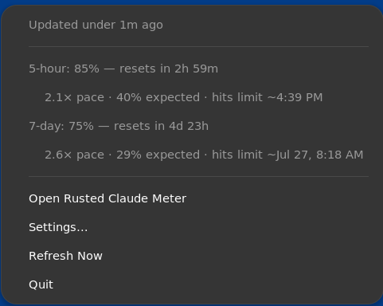
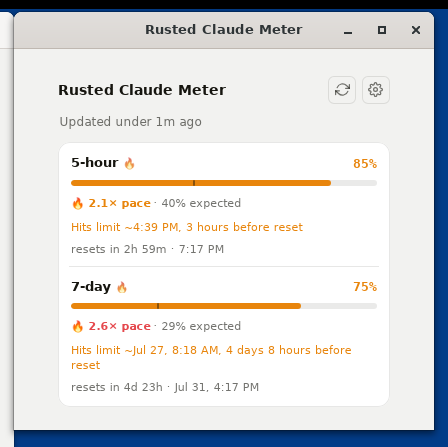
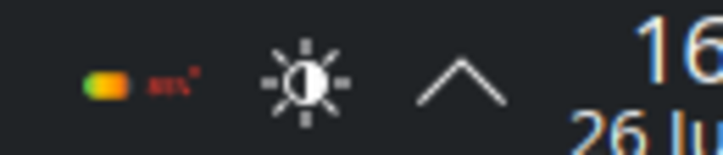
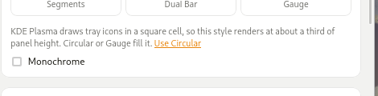
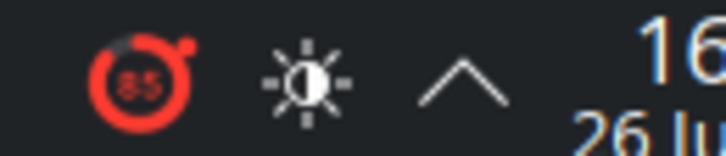
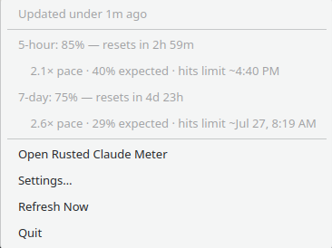
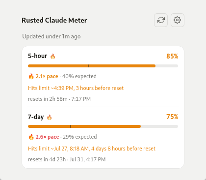

# Rusted Claude Meter on Linux

The Linux build is a first-class target, but the desktop it runs on shapes it
more than macOS does. This page is what to expect, what the two big desktops
impose, and how to get the best out of each.

Everything below is captured from real GNOME and KDE Plasma sessions running the
shipped `.deb` — see [Regenerating these screenshots](#regenerating-these-screenshots).

## The tray menu is the whole surface

On macOS the tray icon opens a popover. On Linux it opens the **menu**, and
that menu carries the full picture rather than being a list of actions:



- a freshness line (`Updated under 1m ago`, or why the data is stale)
- one line per usage window — the 5-hour session, the 7-day week, and each
  model-scoped limit you have switched on — with its percentage and reset
- an indented line under each with the burn-rate ratio, the usage expected by
  now, and where you are heading: a projected limit-hit time when you are on
  course to run out, or the percentage you will finish at when you are not

The detail line is suppressed while a window is too young to say anything
useful, so early in a session the menu stays short instead of padding itself
with noise — but a front-loaded burst surfaces straight away rather than
waiting the window out. Turning **Enable pace tracking** off in Settings
removes those lines entirely.

**There is no Linux popover, and that is deliberate.** An anchored pop-down
cannot be implemented by an application on Wayland — a client is not allowed to
position its own toplevel, and both GNOME and Plasma 6 default to Wayland. A
correct one needs a GNOME Shell extension or a Plasma plasmoid, which is a
different kind of project. **Open Rusted Claude Meter** gives you the same view
as the macOS popover, in an ordinary resizable window:



## GNOME: the tray needs an extension

GNOME Shell shows **no** `StatusNotifierItem` tray at all unless the
[AppIndicator and KStatusNotifierItem Support](https://extensions.gnome.org/extension/615/appindicator-support/)
extension is installed and enabled. This is not specific to this app — without
it, GNOME provides no tray for anything to appear in, so the icon simply is not
there and the app has no way to be reached once its window is closed.

Install it, then look for the icon in the top bar:


The setup wizard says so on its last step when it detects a GNOME session, so a
first-run user is not left hunting for a missing icon.

## KDE Plasma: pick a square icon

Plasma shows the tray with nothing installed — the direct opposite of GNOME.
What it does instead is render every tray icon into a **square** cell:
`AbstractItem.qml` pins the item's width to its height, and the artwork is
scaled to fit that box with its aspect preserved.

The default **Battery** style is 66×22, three times as wide as it is tall, so
Plasma draws it at about a third of panel height — legible as a colour, not as
a number:



The app notices and offers the fix in **Settings → Tray icon**:



**Circular** and **Gauge** are near-square (26×22), so they fill the cell and
stay readable:



The hint only appears on Plasma, only while you are on a style that would draw
small, and disappears once you act on it. The wide styles are not removed —
if you would rather keep Battery and read the menu instead, nothing stops you.

The menu and window are the same as everywhere else:





## Packages and dependencies

The `.deb` declares `libwebkit2gtk-4.1-0`, `libayatana-appindicator3-1`,
`librsvg2-2`, `libxdo3` and `libgtk-3-0`. The AppImage bundles the app's own
libraries but still needs the WebKit/GTK stack present.

One thing worth knowing that is not expressed as a package dependency: **the
pace badge is an emoji** (🔥 / ❄️). On a minimal install with no emoji font it
renders as a tofu box. Installing one — `fonts-noto-color-emoji` on
Debian/Ubuntu — fixes it.

On Arch there is a `PKGBUILD` in [`packaging/aur`](../packaging/aur), which
links the system WebKit rather than shipping one. That is the recommended
install there, for the reason the next section explains.

## Troubleshooting the AppImage

Every problem in this section is specific to the **AppImage**, and the
underlying reason is the same one: it carries its own copy of WebKit, built
on `ubuntu-22.04` (see [packaging.md](packaging.md) for why that build host),
and then runs it against whatever GPU stack and system libraries the host
happens to have. The `.deb`, the AUR package and a source build all use the
system's WebKit and do not have this class of problem — so if you hit any of
the below and don't want to debug it, switching install method is the
reliable fix rather than a workaround.

**It aborts at startup with an EGL error.** Two variants are known:

```
Could not create default EGL display: EGL_BAD_PARAMETER. Aborting...
Could not create surfaceless EGL display: EGL_BAD_ALLOC. Aborting...
```

Both come from WebKitGTK's DMABUF renderer failing to get a usable EGL
display. `EGL_BAD_PARAMETER` shows up on a GPU-less machine (headless, or
some remote-desktop setups), `EGL_BAD_ALLOC` has been reported on a hybrid
Intel/NVIDIA laptop under Wayland ([issue #50][i50]). In both cases:

```sh
WEBKIT_DISABLE_DMABUF_RENDERER=1 ./Rusted\ Claude\ Meter_*.AppImage
```

gets the process running. On a headless or remote setup, prefer the `.deb`.

**It starts, but a window opens blank.** With the DMABUF renderer disabled
the tray icon appears, but opening the window can still leave it white, with
`WebKitWebProcess` dying on `SIGABRT` — reproducibly, on the hardware in
[issue #50][i50]. This one is **not root-caused.**

What is known is the shape of it. The AppImage bundles 219 libraries,
including `libwebkit2gtk-4.1.so.0` and `libjavascriptcoregtk-4.1.so.0`, but
that bundled WebKit still resolves 58 sonames from the host — so it is an
`ubuntu-22.04` WebKit running against host libraries that, on a rolling
distro, can be years newer. That the crash does not reproduce with a source
build against system WebKit on the same machine fits this, and points away
from the GPU.

Which of those 58 is at fault is **not** established. One theory is worth
recording because it looks plausible and is wrong: a stale host `libjxl`.
The bundled `libwebkit2gtk-4.1.so.0` does not link `libjxl` at all — there
is no such `NEEDED` entry, Ubuntu 22.04's WebKitGTK having been built
without JPEG-XL support — so no host `libjxl` version can affect it, and
updating `libjxl` cannot fix this. Check for yourself with:

```sh
./Rusted\ Claude\ Meter_*.AppImage --appimage-extract 'usr/lib/libwebkit2gtk*' >/dev/null
readelf -d squashfs-root/usr/lib/libwebkit2gtk-4.1.so.0 | grep NEEDED
```

If you can reproduce the crash, [#50][i50] is the place to add detail — a
backtrace with symbols, or `WEBKIT_DEBUG` output, would narrow those 58 down.

Until it is understood, the answer is the `.deb`, the AUR package, or a
source build.

[i50]: https://github.com/mpecan/rusted-claude-meter/issues/50

## Credentials

The session key goes to the desktop's Secret Service — GNOME Keyring on GNOME,
KWallet on Plasma. There is no plaintext fallback: if the Secret Service is
unavailable the app says so and stores nothing.

On Plasma, the first save creates a wallet, and KWallet prompts for it. Accept
the dialog (a blank password is fine if you do not want one). If you dismiss
it, the app reports the credential store as unavailable rather than waiting.

## Regenerating these screenshots

They come from the container harness, not from a hand-arranged desktop, so they
can be regenerated whenever the UI changes:

```console
$ just demo-server                  # in one terminal
$ just container-up gnome
$ just container-up kde
$ harness/bin/screenshots.sh        # writes docs/screenshots/linux/
```

The harness runs both desktops in podman containers against a demo API, so no
claude.ai session key or network access is involved. See
[`harness/README.md`](../harness/README.md).
